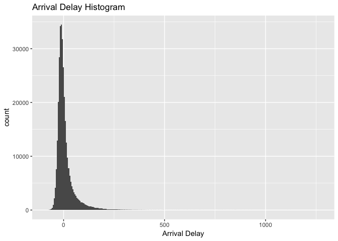
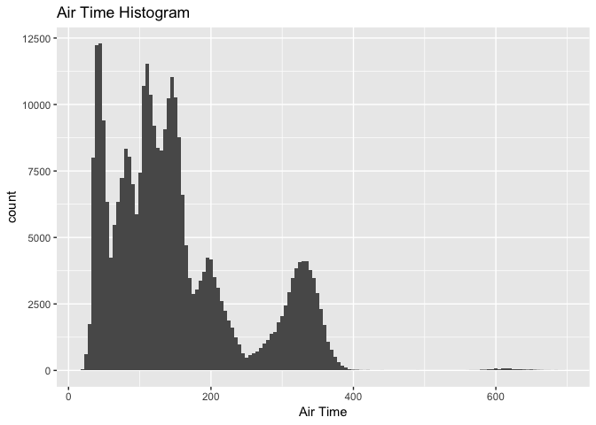

Analysis of 2013 New York City Flights
================
Timothy Pace
7/24/2018

Preprocessing
=============

Data: We will use the nycflights13 R package that contains data for all flights that departed NYC (i.e. JFK, LGA or EWR) in 2013.

``` r
#install.packages("ggplot2")
library("ggplot2")

#install.packages("nycflights13") # install package if you have not already
library(nycflights13) # load library
data(flights) # load data on flights
```

Exploratory Data Analysis: Let's explore flights from NYC to Seattle.
=====================================================================

``` r
# How many flights were there to and from NYC in 2013?
dim(flights)
```

    ## [1] 336776     19

``` r
nrow(flights)
```

    ## [1] 336776

``` r
# How many flights were there from NYC airports to Seattle (SEA) in 2013?
sum(flights$dest == "SEA")
```

    ## [1] 3923

``` r
# How many airlines fly from NYC to Seattle?
length(unique(flights$carrier[flights$dest == "SEA"]))
```

    ## [1] 5

``` r
# What is the average arrival delay for flights from NYC to Seattle? 
mean(flights$arr_delay[flights$dest == "SEA"], na.rm = TRUE)
```

    ## [1] -1.099099

Flights are often delayed - consider the following questions exploring delay patterns (in minutes).
===================================================================================================

``` r
# What is the mean arrival delay time? What is the median arrival delay time?
mean(flights$arr_delay, na.rm = TRUE)
```

    ## [1] 6.895377

``` r
median(flights$arr_delay, na.rm = TRUE)
```

    ## [1] -5

``` r
# What does a negative arrival delay mean? That a plane arrived earlier than scheduled, and was not delayed. 

# Plot a histogram of arrival delay times. 
ggplot(flights, aes(arr_delay)) + geom_histogram(binwidth = 5) + 
  labs(title = "Arrival Delay Histogram", x = "Arrival Delay")
```

    ## Warning: Removed 9430 rows containing non-finite values (stat_bin).



``` r
hist(flights$arr_delay, xlab = "Arrival Delay", main = "Arrival Delay Histogram")
```


The histogram of arrival delay times (mean = 6.9, median = -5) is consistent with the shape of the delay time distribution. The distribution is skewed to the right, which pushes the mean to the right of the median. Although it is difficult to tell, the majority of the mass of the distribution is negative, which is consistent with the median obtained in the previous question.

Is there seasonality in departure delays? Is there a best month to leave New York? A worst? Why might this be?
==============================================================================================================

``` r
by(flights$dep_delay, flights$month, function(x) mean(x, na.rm=T))
```

    ## flights$month: 1
    ## [1] 10.03667
    ## -------------------------------------------------------- 
    ## flights$month: 2
    ## [1] 10.81684
    ## -------------------------------------------------------- 
    ## flights$month: 3
    ## [1] 13.22708
    ## -------------------------------------------------------- 
    ## flights$month: 4
    ## [1] 13.93804
    ## -------------------------------------------------------- 
    ## flights$month: 5
    ## [1] 12.98686
    ## -------------------------------------------------------- 
    ## flights$month: 6
    ## [1] 20.84633
    ## -------------------------------------------------------- 
    ## flights$month: 7
    ## [1] 21.72779
    ## -------------------------------------------------------- 
    ## flights$month: 8
    ## [1] 12.61104
    ## -------------------------------------------------------- 
    ## flights$month: 9
    ## [1] 6.722476
    ## -------------------------------------------------------- 
    ## flights$month: 10
    ## [1] 6.243988
    ## -------------------------------------------------------- 
    ## flights$month: 11
    ## [1] 5.435362
    ## -------------------------------------------------------- 
    ## flights$month: 12
    ## [1] 16.57669

``` r
plot(by(flights$dep_delay, flights$month, function(x) mean(x, na.rm=T)))
```


``` r
which.min(by(flights$dep_delay, flights$month, function(x) mean(x, na.rm=T)))
```

    ## 11 
    ## 11

``` r
which.max(by(flights$dep_delay, flights$month, function(x) mean(x, na.rm=T)))
```

    ## 7 
    ## 7

The pattern appears to be that delays increase approaching summer months, decrease following summer months, and then increase again during December and the holiday travel season. November is the best month to leave New York. This may be because the weather in the Northern hemisphere gets colder approaching winter months, and people may be less likely to travel on vacation during poor weather. Therefore, departure delays may be less because less people are flying on vacation when the weather is poor.

July is the worst month to leave New York. This may be because more people may be traveling on summer vacations, and July coincides with the 4th of July holiday in the US. Therefore, the airport may be busier, more people may have to go through security, and thus planes may be more delayed in their departure schedules more as a result.

``` r
plot(by(flights$dep_delay, flights$month, length))
```


It also appears less flights take place overall in the fall and winter months relative to spring and summer months, with peak travel rates occurring in July and August. Therefore, there may be less departure delays because there are less flights overall during these months.

Plots a histograms of the total air flight time with 100 breaks - How many peaks are there in the distribution? What is an explanation for this?
================================================================================================================================================

``` r
hist(flights$air_time, breaks = 100, xlab = "Air Time", main = "Air Time Histogram")
```


``` r
ggplot(flights, aes(air_time)) + geom_histogram(binwidth = 5) + 
  labs(title = "Air Time Histogram", x = "Air Time")
```

    ## Warning: Removed 9430 rows containing non-finite values (stat_bin).



I see 6 or 7 peaks in the distribution of total air flight time, depending on whether or not you include the mode around the air time of 600. Each of these peaks may coincide with traveling from different geographic destinations. For example, perhaps the peak with the largest air time represents flights originating from Europe or Asia, and perhaps the peak with the shortest amount of air time represents domestic flights on the East Coast that are not far away from New York city, and thus require less air time. The peaks may also represent different air traffic hubs with consitent travel between those hubs and New York.

What time of day do flights most commonly depart? Why might there be two most popular times of day to depart?
=============================================================================================================

``` r
dep_hours <- table(floor(flights$dep_time / 100))
dep_hours[1] <- dep_hours[1] + dep_hours[25]
dep_hours <- dep_hours[-25]
plot(dep_hours, xlab = "Hour of Departure", ylab = "Frequency", 
     main = "Plot of Hour of Departure Frequency")
```


``` r
hist(flights$hour, xlab = "Hour of Departure", main = "Histogram of Hour of Departure")
```


Early morning and mid afternoon are the two most popular times to depart (e.g. 05:00-07:00 and 14:00-16:00. This may be because the multiple destination nature of travel. For example, for early morning flights, it may take longer to get to a specific destination, and thus you would want to leave earlier. Comparatively, for later afternoon flights, you may not have to leave as early because it may not take as long to get to the destination.

Plots a box plot of departure delays and hour of departure. What patterns are there? What is an explanation for this?
=====================================================================================================================

``` r
boxplot(flights$dep_delay ~ flights$hour, ylab = "Departure Delay", xlab = "Hour of Departure",
        main = "Boxplot of Departure Delays vs. Hour of Departure")
```


``` r
boxplot(flights$dep_delay ~ flights$hour, ylab = "Departure Delay", xlab = "Hour of Departure", 
        main = "Boxplot of Departure Delays vs. Hour of Departure",
        ylim = c(-50, 100))
```


The pattern appears to be that increased average departure delays are associated with later departure hours during the day.Later departure hours may be associated with increased departure delays because airports may become busier as the day progresses, with more passengers having to check in and go through security, which in turn may delay departures more. Later departure hours may also be associated wtih increased departure delays because earlier delays may build upon one another and have a cascading effect on one another as the day progresses, resulting in even greater departure delays for later flights.

Do total arrival and departure delay times to and from New York differ depending on which airline carrier is flying, and how can consumers use this information to better choose which airline they should fly when traveling to or from New York?
==================================================================================================================================================================================================================================================

``` r
by(flights$dep_delay + flights$arr_delay, flights$carrier, function(x) mean(x, na.rm = TRUE))
```

    ## flights$carrier: 9E
    ## [1] 23.81924
    ## -------------------------------------------------------- 
    ## flights$carrier: AA
    ## [1] 8.933421
    ## -------------------------------------------------------- 
    ## flights$carrier: AS
    ## [1] -4.100141
    ## -------------------------------------------------------- 
    ## flights$carrier: B6
    ## [1] 22.42552
    ## -------------------------------------------------------- 
    ## flights$carrier: DL
    ## [1] 10.86829
    ## -------------------------------------------------------- 
    ## flights$carrier: EV
    ## [1] 35.63536
    ## -------------------------------------------------------- 
    ## flights$carrier: F9
    ## [1] 42.12188
    ## -------------------------------------------------------- 
    ## flights$carrier: FL
    ## [1] 38.72189
    ## -------------------------------------------------------- 
    ## flights$carrier: HA
    ## [1] -2.01462
    ## -------------------------------------------------------- 
    ## flights$carrier: MQ
    ## [1] 21.22011
    ## -------------------------------------------------------- 
    ## flights$carrier: OO
    ## [1] 24.51724
    ## -------------------------------------------------------- 
    ## flights$carrier: UA
    ## [1] 15.57492
    ## -------------------------------------------------------- 
    ## flights$carrier: US
    ## [1] 5.874288
    ## -------------------------------------------------------- 
    ## flights$carrier: VX
    ## [1] 14.52111
    ## -------------------------------------------------------- 
    ## flights$carrier: WN
    ## [1] 27.31078
    ## -------------------------------------------------------- 
    ## flights$carrier: YV
    ## [1] 34.45588

``` r
which.min(by(flights$dep_delay + flights$arr_delay, flights$carrier, function(x) mean(x, na.rm = TRUE)))
```

    ## AS 
    ##  3

``` r
barplot(sort(by(flights$dep_delay + flights$arr_delay, flights$carrier, function(x) mean(x, na.rm = TRUE))), 
        xlab = "Carrier", 
        ylab = "Mean Total Departure and Arrival Delay Time", 
        main = "Barplot of Carrier vs. Mean of Total Departure and Arrival Delay Time")
```


``` r
boxplot((flights$dep_delay + flights$arr_delay) ~ flights$carrier, xlab = "Carrier", 
        ylab = "Total Departure and Arrival Delay Time",
        main = "Boxplot of Carrier vs. Total Departure and Arrival Delay Time")
```


``` r
boxplot((flights$dep_delay + flights$arr_delay) ~ flights$carrier, xlab = "Carrier", 
        ylab = "Total Departure and Arrival Delay Time",
        main = "Boxplot of Carrier vs. Total Departure and Arrival Delay Time",
        ylim = c(-100, 200),
        cex = .1)
```


These results suggest that there is a wide variation in average total travel delay times between the different airlines. These results also suggest that, when flying to or from New York, if a passenger would like to minimize the total delay that they experience both departing and arriving, they should consider flying on airline AS (Alaska Airlines), as AS has the lowest mean total arrival and delay time (-4.1). This also means that AS has a negative average total delay and departs and arrives earlier on average relative to other carriers. Some of the worst airlines are YV, EV, FL, F9 with mean total delays of 30 minutes or more. Meanwhile, AS (Alaskan) and HA (Hawaiian) arrive early on average. However, there may be confounding factors, as AS may fly to destinations that are less likely to experience delays. On average, when you are booking a result with AS you will get a better result than F9.
